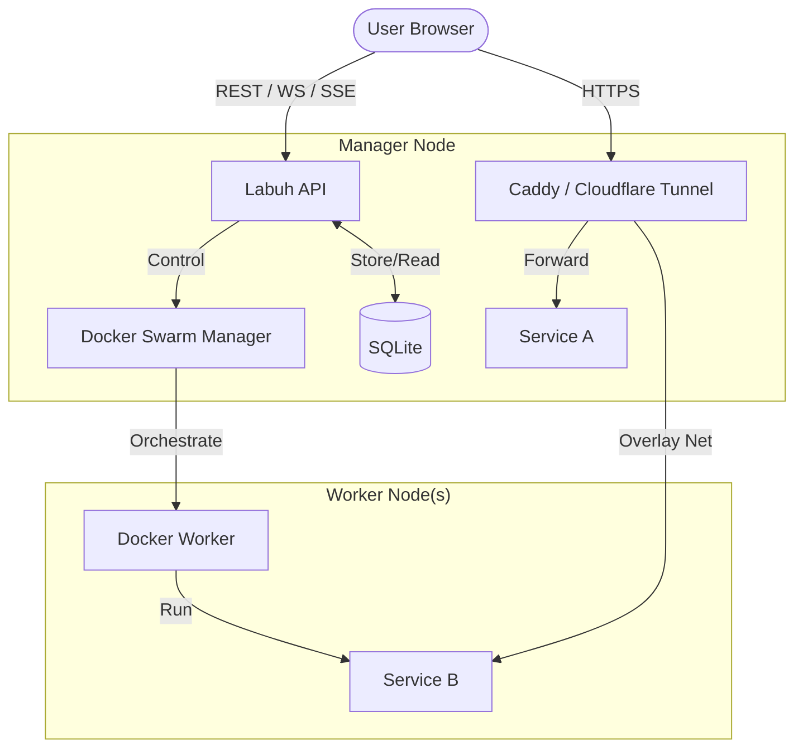

# Architecture

Labuh dirancang dengan prinsip **Simplicity over Complexity**. Berikut adalah gambaran bagaimana komponen-komponen Labuh saling bekerja sama.

## Komponen Utama

### 1. Labuh Core (Backend)

Ditulis menggunakan **Rust** dengan framework **Axum**.

- **Role**: Mengelola database, menjalankan manajemen container lewat Docker API, dan melayani API serta Dashboard.
- **Efisiensi**: Sangat cepat dan mengonsumsi memori yang sangat sedikit.
- **Streaming**: Mendukung **WebSockets** untuk terminal interaktif dan **Server-Sent Events (SSE)** untuk streaming log build secara real-time.

### 2. Dashboard (Frontend)

Dibangun dengan **SvelteKit** dan **Svelte 5**.

- **Role**: Antarmuka pengguna yang reaktif untuk manajemen stack, container, dan monitoring.
- **Deployment**: Di-build menjadi aplikasi statis (SPA) dan disajikan langsung oleh binary backend.

### 3. Caddy (Reverse Proxy)

Dijalankan sebagai container pendamping otomatis.

- **Role**: Menangani koneksi masuk (Port 80/443), melakukan SSL termination secara otomatis, dan meneruskan request ke container aplikasi yang tepat.

### 4. SQLite (Database)

Database file-based yang ringan.

- **Role**: Menyimpan konfigurasi stack, rute domain, kredensial registry, dan riwayat deployment.

## Alur Data

## Keamanan

- **JWT Auth**: Semua akses API dan Dashboard dilindungi oleh token JWT dengan masa berlaku tertentu.
- **Isolated Networks**: Labuh membuat network terisolasi (`labuh-network`) sehingga container aplikasi hanya bisa diakses lewat Caddy, bukan langsung dari internet kecuali jika Anda mengekspos portnya secara eksplisit.
- **Permission Checks**: Setiap akses ke log, terminal, atau kontrol container diverifikasi berdasarkan kepemilikan team/user.
